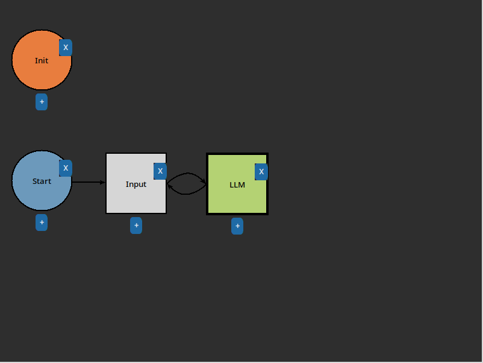

(Connector)=
# Connectors

Connectors are how flow is controlled in the Flowchart. They are the arrows that connect [Nodes](nodes.md) together.

**Additionally, Connectors can be double-clicked to add a condition.** Conditions are represented by Python functions. They use the same general signature as [Functions](Function), but instead of returning a value, they return a boolean. If the condition returns `True`, the flow will continue down that connector. If the condition returns `False`, the flow will continue down the next connector. If no connectors are `True`, the flow will halt.

## Example: Censor

Let's create a simple user censor to stop the conversation if they mention "coconuts". First, create the following flowchart:



Now double-click the top Connector to open the condition editor:


Edit the condition to be as follows, then save with `File->Save` or `Ctrl+S`:

```python
def main(state):
	return 'coconut' not in state.result
```

Now run the flowchart and chat with the basic AI. If you mention "coconuts", the flow will stop:

```text
Init: 

[System: Done]
Start: 
Input: hello
LLM: Hello! How can I assist you today?
Input: what is a coconut?

[System: Done]
```

This is just a simple chatbot; for a more complex example, see [Usage](working-with-llms), which incorporates the [History](History) node. It should also go without saying this approach is not a good way to censor users, as they can easily get around it. It's just an example of how to use conditions.
