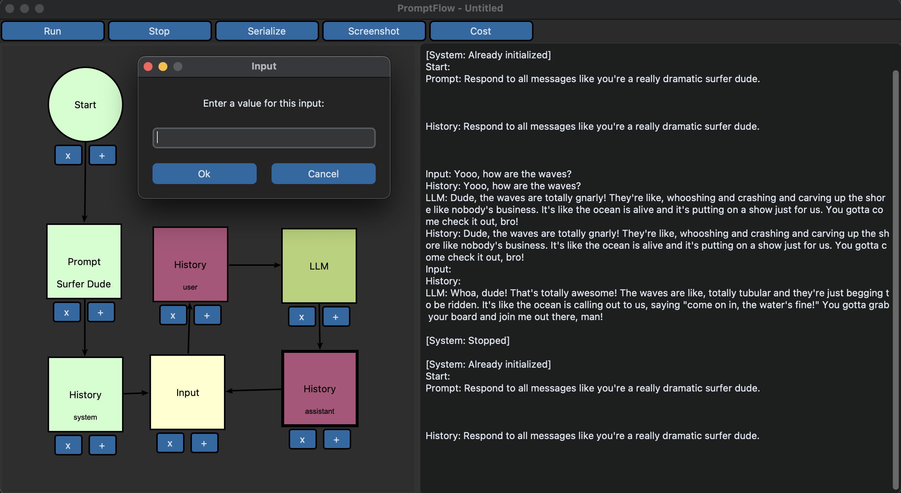

.. PromptFlow documentation master file, created by
   sphinx-quickstart on Wed Apr 26 12:24:51 2023.
   You can adapt this file completely to your liking, but it should at least
   contain the root `toctree` directive.

Welcome to PromptFlow's documentation!
======================================

.. toctree::
   :maxdepth: 2
   :caption: Contents:

PromptFlow is a tool that allows you to create executable flowcharts that 
link LLMs (Large Language Models), Prompts, Python functions, and 
conditional logic together. With PromptFlow, you can create complex 
workflows in a visual way, without having to write too much code or 
deal with complicated logic.

`View PromptFlow on GitHub here. <https://github.com/InsuranceToolkits/promptflow>`_

How it works
------------
PromptFlow is based on a visual flowchart editor that allows you to 
create nodes and connections between them. Each node can be a :ref:`Prompt`,
a Python :ref:`Function`, or an :ref:`LLM`. Connections between nodes represent
conditional logic, and allow you to specify the flow of your program.

When you run your flowchart, PromptFlow will execute each node in the
order specified by the connections, passing data between nodes as needed. 
If a node returns a value, that value will be passed to the next node in 
the flow.

Check out the :doc:`usage` section for further information.

Contribution
------------
The biggest contribution you can make to PromptFlow is to create new :ref:`Node`.

A walkthrough of how to create a new node can be found in the :doc:`development` section.

Indices and tables
==================

* :ref:`genindex`
* :ref:`modindex`
* :ref:`search`

Contents
--------

.. toctree::

   usage
   nodes
   connectors
   development