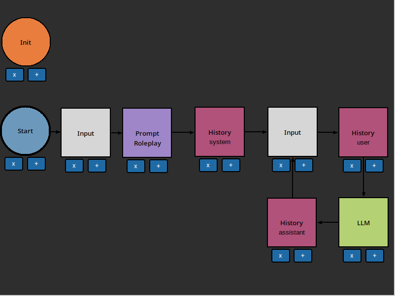
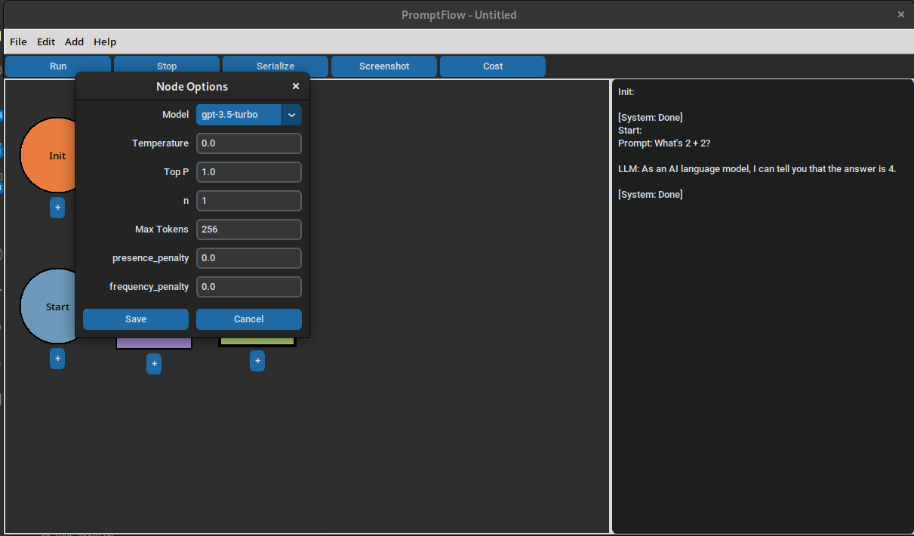
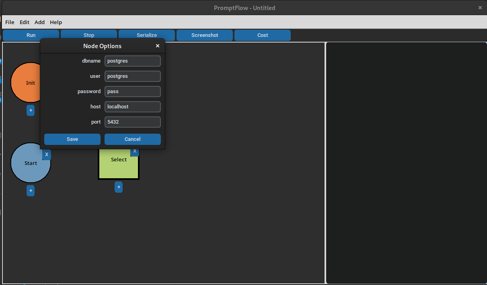

# Nodes

Nodes are the primary building blocks of a Flowchart. They are the individual components that make up a flowchart. Nodes are connected by edges, and each node has a specific function.

(Init)=
## Init

The Init node is run once and only once at the beginning of the flowchart. It is used to initialize external resources, such as vecstores, embeddings, or databases.

(Start)=
## Start

The Start node is the beginning of your flowchart. It will *always* run first, and can be connected to any other node in your flowchart.

(Input)=
## Input

Pauses the flowchart and waits for user input. Useful for chatbots or interactive programs.

(History)=
## History

Saves the output of the previous node to a running history. Useful for chatbots or interactive programs. Follows OpenAI's history scheme, with 3 roles: `assistant`, `user`, and `system`. Double-click the node to edit which role the node will save to.

For a simple example of History Node usage, see [Usage](working-with-llms).

(Prompt)=
## Prompt

Outputs an f-string style formatted string. You can edit the prompt text by double-clicking the lower `Prompt` label on the node.

For a simple example of Prompt Node usage, see [Usage](working-with-llms).

### Usage

To inject the result of the previous node, use `{state.result}`. For example:

```text
You are a {state.result}. Please stay in character, and answer as a {state.result} would.
```

Connecting the following flowchart would allow the user to program any "personality" they want:



(LLM)=
## LLM

Call to a Large Language Model. Currently restricted to OpenAI's API. Double-click to edit the LLM parameters.




(Function)=
## Function

Run an arbitrary Python function. The default function signature is:

```python
def main(state: State):
    return True
```

The signature of `State` is as follows:

```python
class State(Serializable):
    """
    Holds state for flowchart flow
    Wraps a dict[str, str]
    """

    def __init__(self, **kwargs):
        self.snapshot: dict[str, str] = kwargs.get("state", {})
        self.history: list[dict[str, str]] = kwargs.get("history", [])
        self.result: str = kwargs.get("result", "")
```

Where `snapshot` is a dictionary of all the results of previous nodes, `history` is a list of all the results of previous [`History`](History) nodes, and `result` is the result of the previous node.

Right now, any `imports` need to go inside the `main` function. For example, lets create a JSON extractor, which gets a field from a JSON string:

```python
def main(state: State):
    import json
    return json.loads(state.result)["field"]
```

(Memory)=
## Memory

The [`History`](History) node saves to an "infinite" memory, which isn't feasible for LLMs, which have token limits. The Memory node allows you to apply various memory strategies to the history. 

(WindowedMemory)=
### WindowedMemory

The WindowedMemory node saves the last `n` results of the [`History`](History) node. This is useful for LLMs, which have token limits. Double-click the node to edit the window size.

(DynamicWindowedMemory)=
### DynamicWindowedMemory

The DynamicWindowedMemory node saves the last `n` results of the [`History`](History) node since a target string has appeared in the history. This is useful for LLMs, which have token limits. Double-click the node to edit the window size and target string.


(Date)=
## Date

Outputs the current date and time. Useful for injecting into a [`Prompt`](Prompt) node. Double-click the node to edit the date format.

(Database)=
## Database

Connects to a database and runs a query. Double-click the node to edit the database connection parameters:



(Select)=
### Select

The Select node selects a single row from the database. The query is `state.result`, so you can use the result of a previous node to select a row. 

(PGML)=
### PGML Support

[PostgresML](https://postgresml.org/) is supported by PromptFlow. Currently, only the `generate` function is supported.

(Generate)=
#### Generate

The Generate node uses a pgml model to complete a prompt. The prompt is `state.result`, so you can use the result of a previous node to select a row. `model` can be selected by double-clicking the node.